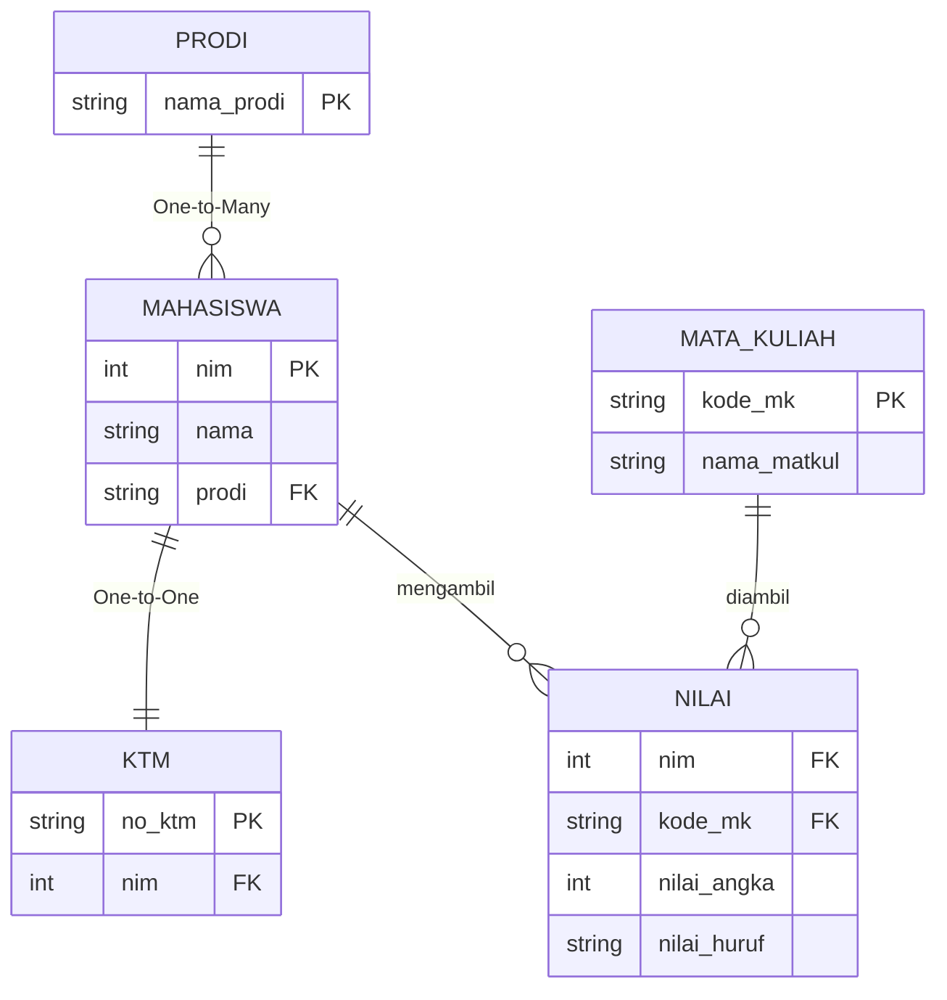
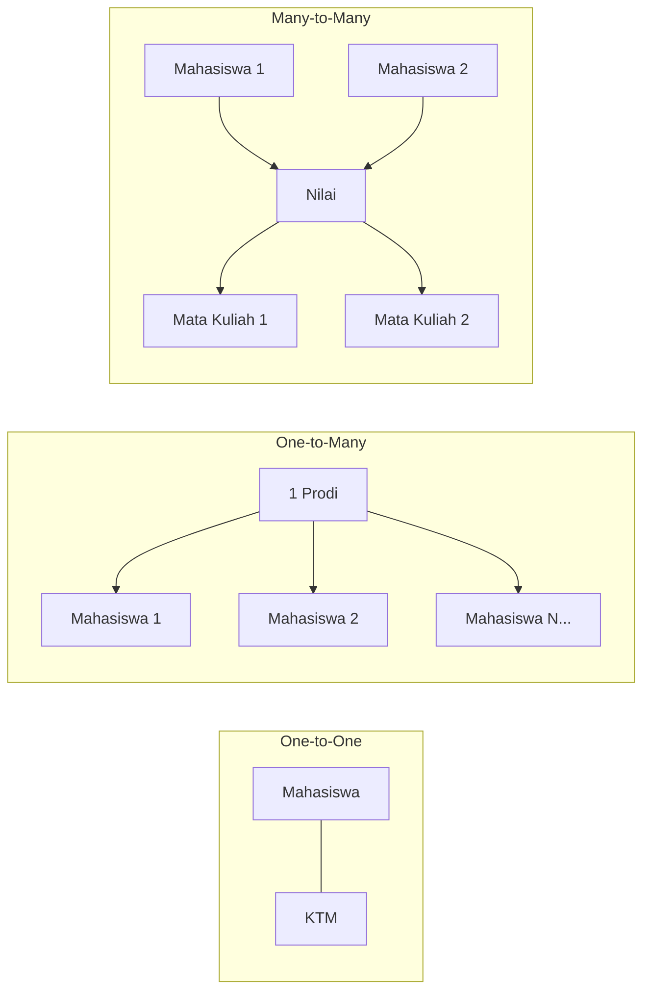
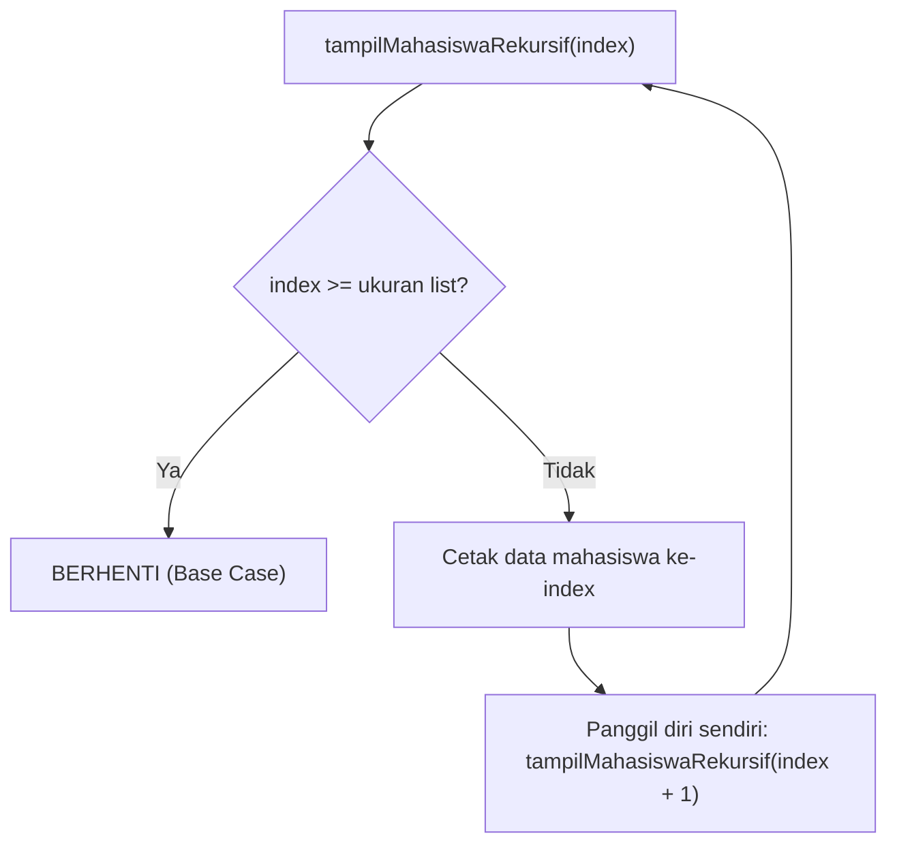

# ERD - Tugas Pertemuan 4 (Simple)

Diagram relasi data berdasarkan [TugasPertemuan4Simple.java](file:///home/said/Documents/GitHub/belajar-struktur-data/TugasPertemuan4Simple.java)

## Entity Relationship Diagram

> **NILAI** adalah tabel penghubung (associative table) yang membentuk relasi **Many-to-Many** antara MAHASISWA dan MATA_KULIAH.

## Diagram Relasi

## Alur Logika Rekursif

